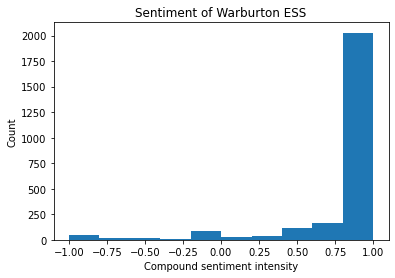
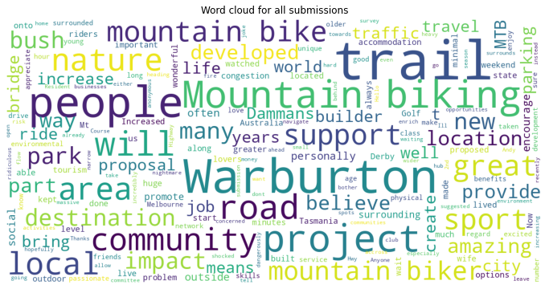
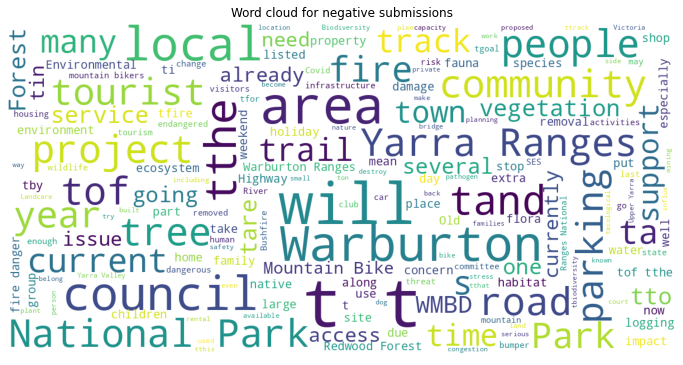
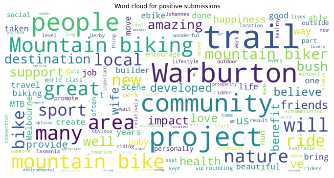

The Mountain bike park planned for Warburton has been extremely controversial with social and environmental concerns regularly voiced by critics. An Environment Effects Statement, a comprehensive study of the environmental impacts of large infastructure projects was ordered. One of the steps of the ESS is a call for community feedback. The community feedback for the Warburton MTB project was conducted in late 2021 and the responses were made public in early 2022. There were over 2500 submissions from the general public, including mountain bike riders and environmentalists. In this post I will use some basic machine learning techniques for automatically analysing the text in the submissions with the aim of understanding whether the overall feedback was positive or negative. To do this the ess results needed to be downloaded from the repository holding them, the pdf files need to be converted into plain text and the results analysed for the sentiment. All of this work will be performed with Python.


## Downloading and reading PDF files

The community submissions for the ESS can be found [here](!https://engage.vic.gov.au/project/warburton-iac/page/warburton-IAC-submissions). Taking a look at the individual files we can see that each file containing the submissions have the same structure https://engage.vic.gov.au/download/document/23728 where the number 23728 increased for each submission file.
Looking at the submissions the structure of the submissions are similar layout.


To read a PDF using Python there are numerous libraries available. My preference is pdfplumber because it has an easy to use API to adapt it to particular use cases. To read a PDF using pdfplumber we just need to use the following code:

<div class="codecell" markdown="1">
<div class="input_area" markdown="1">

```python
import ssl
import urllib
import pdfplumber
import io
all_text=''
url = 'http://engage.vic.gov.au/download/document/23671'
gcontext = ssl.SSLContext()  
req=urllib.request.Request(url)

resp=urllib.request.urlopen(req,context=gcontext)
data = resp.read()
with pdfplumber.open(io.BytesIO(data)) as pdf:
    for p in pdf.pages:
        text = p.extract_text()
        all_text+=text.replace('\n',' ')
print(all_text[:1000])
```

</div>
<div class="output_area" markdown="1">

    Submission Cover Sheet 1 Warburton Mountain Bike Destination Inquiry and Advisory  Committee  Request to be heard?: No Full Name: Andrew Gard Organisation: Affected property: Attachment 1: Attachment 2: Attachment 3: Comments: I believe this project should go ahead. It will create a wider community of mtb riders  and also allow new people to get out and about in the nature on the trails of  Warburton and surrounds.  I believe it will bring more money into the local  communities with hopefully, new businesses being able to open and create new job  opportunities.  Thanks, Andy.Submission Cover Sheet 2 Warburton Mountain Bike Destination Inquiry and Advisory  Committee  Request to be heard?: No Full Name: Mathew Stoessiger Organisation: Affected property: Attachment 1: Attachment 2: Attachment 3: Comments: I support the Warburton Mountain Bike Destination Project, the project will create  jobs and enrich peoples lives through outdoor activities with minimal impact on the  environment.Subm
    

</div>

</div>

Where we are downloading the PDF as a binary data file using urllib. We need to provide an empty ssl certificate to avoid missing certificate errors. If you wanted to reuse this code and adapt it to a different dataset you may not need this, or you may need to provide a valid certificate depending on the security of the source website.  

`pdfplumber.open()` provides an object for accessing different elements of the pdf. For this example we want to extract all of the text from every page. This can be done by iterating over the pages in the pdf and using extract_text to retrieve the text. Here I am just going to use a string to store all of the text, because there is no guarentee that each page is a new submission. Long submissions may have multiple page comments and we ideally want to keep these together.

We can apply this process to all of the submissions by iterating over the filename. We can change the url of the submission using Pythons fstring formatting. Unfortunately, the submissions files are not numbered consecutively and some do not exist, to avoid crashing the code we can wrap the code in a try/except block. 

<div class="codecell" markdown="1">
<div class="input_area" markdown="1">

```python
all_text = ''
for i in range(23671,23728):
    url =  f'http://engage.vic.gov.au/download/document/{i}'
    try:
        gcontext = ssl.SSLContext()  
        req=urllib.request.Request(url)

        resp=urllib.request.urlopen(req,context=gcontext)
        data = resp.read()
        with pdfplumber.open(io.BytesIO(data)) as pdf:
            for p in pdf.pages:
                text = p.extract_text()
                all_text+=text.replace('\n',' ')
        #
        # import pdf files and save to text
        # 
    except BaseException as e:
        print(e, url)
```

</div>
<div class="output_area" markdown="1">

    HTTP Error 404: Not Found http://engage.vic.gov.au/download/document/23692
    HTTP Error 404: Not Found http://engage.vic.gov.au/download/document/23694
    HTTP Error 404: Not Found http://engage.vic.gov.au/download/document/23711
    HTTP Error 404: Not Found http://engage.vic.gov.au/download/document/23712
    

</div>

</div>
<div class="codecell" markdown="1">
<div class="input_area" markdown="1">

```python
# save all of the comments to a file to avoid re-downloading
import pickle
with open('warburton.pkl', 'wb') as f:
    pickle.dump(all_text,f)

```

</div>

</div>
<div class="codecell" markdown="1">
<div class="input_area" markdown="1">

```python
import pickle
with open('warburton.pkl', 'rb') as f:
    all_text = pickle.load(f)#pickle.dump(all_text,f)
```

</div>

</div>

We now have a large string with all of the submission. We can see that every submission has the title page 'Submission Cover Sheet'. To break the submissions into categories we can split the string into separate strings using the string function split.

<div class="codecell" markdown="1">
<div class="input_area" markdown="1">

```python
submissions = all_text.split('Submission Cover Sheet')
```

</div>

</div>
<div class="codecell" markdown="1">
<div class="input_area" markdown="1">

```python
submissions[1]
```

</div>
<div class="output_area" markdown="1">


    ' 1 Warburton Mountain Bike Destination Inquiry and Advisory  Committee  Request to be heard?: No Full Name: Andrew Gard Organisation: Affected property: Attachment 1: Attachment 2: Attachment 3: Comments: I believe this project should go ahead. It will create a wider community of mtb riders  and also allow new people to get out and about in the nature on the trails of  Warburton and surrounds.  I believe it will bring more money into the local  communities with hopefully, new businesses being able to open and create new job  opportunities.  Thanks, Andy.'


</div>

</div>

Looking at an individual submission we can see that the text following **Comment:** is what we are interested in. We can extract all of the text following the comments by spliting the text after 'Comments:'.
<div class="codecell" markdown="1">
<div class="input_area" markdown="1">

```python
comments = []
for submission in submissions:
    if 'Comments:' in submission:
        comments.append(submission.split('Comments:')[1])
```

</div>

</div>
<div class="codecell" markdown="1">
<div class="input_area" markdown="1">

```python
print(f'There are {len(comments)} submissions')
```

</div>
<div class="output_area" markdown="1">

    There are 2548 submissions
    

</div>

</div>

## Sentiment analysis
We now have a list containing the text for each comment. Now we want to determine whether the overall sentiment of the comment is positive or negative. Sentiment analysis is one of the techniques of natural language processing. Different models exist and its generally best to build a model using a training database. For this example, we will use a pre-trained model from the natural language tool kit. Before using the sentiment analysis we need to remove any uncessary words from the comments, these include "a, an, the for" etc.

<div class="codecell" markdown="1">
<div class="input_area" markdown="1">

```python
import nltk
from nltk.corpus import stopwords 
from nltk.sentiment import SentimentIntensityAnalyzer
# download the nltk files for the first run
nltk.download('stopwords')
nltk.download('vader_lexicon')
stop_words = set(stopwords.words('english'))
comments_no_stop_words = []
for comment in comments:
    comments_no_stop_words.append([w for w in comment.split(' ') if not w.lower() in stop_words])


```

</div>
<div class="output_area" markdown="1">

    [nltk_data] Downloading package stopwords to
    [nltk_data]     C:\Users\lgrose\AppData\Roaming\nltk_data...
    [nltk_data]   Package stopwords is already up-to-date!
    [nltk_data] Downloading package vader_lexicon to
    [nltk_data]     C:\Users\lgrose\AppData\Roaming\nltk_data...
    [nltk_data]   Package vader_lexicon is already up-to-date!
    

</div>

</div>
<div class="codecell" markdown="1">
<div class="input_area" markdown="1">

```python
sia = SentimentIntensityAnalyzer()
sia.polarity_scores(' '.join(comments_no_stop_words[0]))
```

</div>
<div class="output_area" markdown="1">


    {'neg': 0.0, 'neu': 0.662, 'pos': 0.338, 'compound': 0.9062}


</div>

</div>
<div class="codecell" markdown="1">
<div class="input_area" markdown="1">

```python
import pandas as pd
sentiment = pd.DataFrame([['',0,0,0,0]],columns=['comment','neg','neu','pos','compound'])
sia = SentimentIntensityAnalyzer()
for i, comment in enumerate(comments_no_stop_words):
    r = sia.polarity_scores(' '.join(comment))
    sentiment.loc[i,'comment'] = comments[i] 
    sentiment.loc[i,'neg'] = r['neg']
    sentiment.loc[i,'neu'] = r['neu']
    sentiment.loc[i,'pos'] = r['pos']
    sentiment.loc[i,'compound'] = r['compound']
```

</div>

</div>

## Interpreting the results
The results of the sentiment intensity analyser are four numbers specifying the negative, positive, neutral and compound sentiment. The initial objective was to determine what the split between negative and positive submissions for the Warburton mountain bike park. To do this we need to first validate how well the method works by looking at submissions for different sentiments. 
<div class="codecell" markdown="1">
<div class="input_area" markdown="1">

```python
import matplotlib.pyplot as plt
fig, ax = plt.subplots(1)
ax.hist(sentiment['compound'])
ax.set_title('Sentiment of Warburton ESS')
ax.set_xlabel('Compound sentiment intensity')
_ =ax.set_ylabel('Count')
```

</div>
<div class="output_area" markdown="1">


    

    


</div>

</div>

Looking at the distribution of compound sentiment intensity we can see that the majority of responses have a positive sentiment (compound intensity is positive). We can do a quick validation of this assesement by randomly selecting some comments within different sentiment bands to get an understanding of the results. To do this we will mask the pandas dataframe using a boolean mask and then use the random method to sample from the resulting dataframe.

### Sentiment Intensity > 0.8
<div class="codecell" markdown="1">
<div class="input_area" markdown="1">

```python
old_column_width = pd.options.display.max_colwidth 
pd.options.display.max_colwidth = None
sentiment.loc[sentiment['compound']>0.8,['comment','compound']].sample(2)
# pd.options.display.max_colwidth = old_column_widt2
```

</div>
<div class="output_area" markdown="1">


<div>
<style scoped>
    .dataframe tbody tr th:only-of-type {
        vertical-align: middle;
    }

    .dataframe tbody tr th {
        vertical-align: top;
    }

    .dataframe thead th {
        text-align: right;
    }
</style>
<table border="1" class="dataframe">
  <thead>
    <tr style="text-align: right;">
      <th></th>
      <th>comment</th>
      <th>compound</th>
    </tr>
  </thead>
  <tbody>
    <tr>
      <th>204</th>
      <td>My submission is simply a short commentary on the contents of the EES and the  overall project direction, along with a personal story about the positive impacts of  mountain bike trails. First of all, I do not claim to be an expert on any of the  considerations considered in the EES –biodiversity, water, cultural heritage, land  use, socio-economic or transport. However, upon digesting the contents of the  report, it is apparent to me that the Warburton Mountain Bike Destination (WMBD)  team have engaged with a broad array of experts in their field and have used that  expertise to prepare an incredibly detailed statement of the effects of the project. I  have seen firsthand the benefits of large, sanctioned trail centres. I grew up in  Alberta, Canada, and through the fantastic trail networks in Kananaskis Country at  Moose Mountain and West Bragg Creek, I had the opportunity to get involved in  mountain biking from a young age. That opportunity resulted in me becoming a  keen mountain biker, and as I spent long hours and days on my bike in Kananaskis, I  developed a love for and connection to the area. That connection had two  significant impacts on my life: 1. I care deeply about the beautiful natural places that  I am so fortunate to enjoy on my mountain bike. When there were proposals to  clearfell an area of Kananaskis near the mountain bike trails, I along with many  mountain bikers voiced opposition to the project. It was clear that the members of  the mountain bike community had become connected with the land, and did not  want to see it destroyed. Many of us would not otherwise have known or cared  about the logging that was to occur, but mountain biking taught us about the  environment, and we cared enough to make a difference when it was threatened 2.  Speaking of the mountain biking community, we all came together around a shared  passion. This generated many connections for all of us that we may not otherwise  have had. In this age of profound disconnection and isolation, we should be taking  any opportunity we can find to build these sorts of communities and let them thrive.   In the years since I have moved to Victoria, I have used mountain biking as a vehicle  to get to know the incredible beauty of this state. I would love to see more  Victorians get the opportunity to get on their bikes and through the experience of  mountain biking develop deep connections with their fellow mountain bikers, and  the natural beauty around them. I would love to see more people making a living off  nature-based tourism rather than resource extraction. In fact, if we consider the  opportunities of investing in initiatives like this that would create jobs that do not  require constant resource depletion, it could be argued that the environmental  impact of building the trail centre would be a net positive. And lastly, as a mountain  biker from overseas, I would love to see more mountain bikers come to experience  all that Victoria has to offer.</td>
      <td>0.9978</td>
    </tr>
    <tr>
      <th>2417</th>
      <td>Mountain biking is a growing sport and pastime for many people of all ages and  sexes.  It is a great way to exercise, socialise and have fun.  It is also fantastic to get  out into nature.  Which just about all mountain bikers love and respect.  As it is a  growing sport there are a big lack of places to ride.  We often travel hours to get to a  place to ride.  Having another place as awesome as Warburton to ride would be  incredible and also take some pressure off other riding places and also help stop  illegal tracks being built.  Looking at Tasmania as an example of Mtb and locals  coexisting together very well this can only be a great thing for Warburton and mtbrs  alike.</td>
      <td>0.9761</td>
    </tr>
  </tbody>
</table>
</div>


</div>

</div>

### Sentiment Intensity > 0.6 and < 0.8
<div class="codecell" markdown="1">
<div class="input_area" markdown="1">

```python
sentiment.loc[(sentiment['compound']<0.8) & (sentiment['compound']>0.6),['comment','compound']].sample(2)
```

</div>
<div class="output_area" markdown="1">


<div>
<style scoped>
    .dataframe tbody tr th:only-of-type {
        vertical-align: middle;
    }

    .dataframe tbody tr th {
        vertical-align: top;
    }

    .dataframe thead th {
        text-align: right;
    }
</style>
<table border="1" class="dataframe">
  <thead>
    <tr style="text-align: right;">
      <th></th>
      <th>comment</th>
      <th>compound</th>
    </tr>
  </thead>
  <tbody>
    <tr>
      <th>764</th>
      <td>I believe that this project will be a great economic and social benefit for the area.</td>
      <td>0.7964</td>
    </tr>
    <tr>
      <th>2389</th>
      <td>I love exploring new places on my bike and this would be close to home</td>
      <td>0.6369</td>
    </tr>
  </tbody>
</table>
</div>


</div>

</div>

### Sentiment Intensity > -0.2 and < 0.2
<div class="codecell" markdown="1">
<div class="input_area" markdown="1">

```python
sentiment.loc[(sentiment['compound']<0.2) & (sentiment['compound']>-0.2),['comment','compound']].sample(2)
```

</div>
<div class="output_area" markdown="1">


<div>
<style scoped>
    .dataframe tbody tr th:only-of-type {
        vertical-align: middle;
    }

    .dataframe tbody tr th {
        vertical-align: top;
    }

    .dataframe thead th {
        text-align: right;
    }
</style>
<table border="1" class="dataframe">
  <thead>
    <tr style="text-align: right;">
      <th></th>
      <th>comment</th>
      <th>compound</th>
    </tr>
  </thead>
  <tbody>
    <tr>
      <th>317</th>
      <td>The northern trail network located primarily in the Yarra Ranges National Park,  making up just over third of the trails, should be abandoned. The southern trail  network, just under two-thirds of the trails, occurs mostly in state forest and could  proceed with some modification.  The key issues are with proposed tracks in the  Yarra Ranges National Park.  National Parks are supposed to give nature the  strongest of protections, yet parts of the project will cause undue harm to very  important ecological values, removing important habitat, impacting on threatened  plants animals and communities, water catchments while increasing pest species.   This is neglectful of heritage and socio-economic values and the integrity of national  parks.</td>
      <td>0.0000</td>
    </tr>
    <tr>
      <th>958</th>
      <td>Mountain bike tourism is absolutely booming and will continue to do so. What has  been designed for Warburton will be an absolute boon for the region and bring all  manner of economic and community benefit —as was shown in the work done prior  to the EES. Now with the EES documents completed and more in-depth empirical  work completed than any other mountain bike trail network in the world, the data  shows that there will be almost zero negative impact on the environment or the  community.  If this project does not go forward it will be an absolute travesty and a  huge loss for the folks who live in Warburton as they stand to gain the most from  these trails.</td>
      <td>-0.1832</td>
    </tr>
  </tbody>
</table>
</div>


</div>

</div>

### Sentiment Intensity > -1 and < 0.2
<div class="codecell" markdown="1">
<div class="input_area" markdown="1">

```python
sentiment.loc[(sentiment['compound']<0.2) & (sentiment['compound']>-1),['comment','compound']].sample(2)
```

</div>
<div class="output_area" markdown="1">


<div>
<style scoped>
    .dataframe tbody tr th:only-of-type {
        vertical-align: middle;
    }

    .dataframe tbody tr th {
        vertical-align: top;
    }

    .dataframe thead th {
        text-align: right;
    }
</style>
<table border="1" class="dataframe">
  <thead>
    <tr style="text-align: right;">
      <th></th>
      <th>comment</th>
      <th>compound</th>
    </tr>
  </thead>
  <tbody>
    <tr>
      <th>1361</th>
      <td>Millions of Australians now ride mountain bikes for recreation and fitness, instead of  spending millions of dollars flying overseas and to Tasmania to ride world class trails  let’s build something in our own backyard!   It would be a disaster if this project  didn’t get off ground due to a handful of ill informed and unhappy people who aren’t  interested in others being happy.  “Build it and they shall come…… “</td>
      <td>-0.3595</td>
    </tr>
    <tr>
      <th>1554</th>
      <td>I  object to the  development  of  new mountain  bike  trails  in Warburton  in  the   Yarra  Ranges  National Park. It  will  negatively  impact  on  local wildlife that the   park is set  out to  protect  and  extra  human traffic  will  bring  further  environmental  stress  upon an already  underfunded   National  Parks  system  in   Victoria.</td>
      <td>-0.0516</td>
    </tr>
  </tbody>
</table>
</div>


</div>

</div>

A common technique for visualising text datasets is to generate an image with all of the unique words weighted by their frequency of occurence. These word clouds can help to identify which words are most commonly used in a text to give some idea about the meaning. 
<div class="codecell" markdown="1">
<div class="input_area" markdown="1">

```python
from wordcloud import WordCloud, STOPWORDS
wordcloud = WordCloud(
    background_color='white',
    max_words=200,
    max_font_size=40, 
    scale=3,
    random_state=1 # chosen at random by flipping a coin; it was heads
).generate(str(sentiment['comment']))

fig, ax = plt.subplots(1, figsize=(12, 12))
ax.axis('off')
ax.set_title('Word cloud for all submissions')
ax.imshow(wordcloud)
```

</div>
<div class="output_area" markdown="1">


    <matplotlib.image.AxesImage at 0x1640d371c08>


    

    


</div>

</div>
<div class="codecell" markdown="1">
<div class="input_area" markdown="1">

```python
from wordcloud import WordCloud, STOPWORDS
import matplotlib.pyplot as plt
wordcloud = WordCloud(
    background_color='white',
    max_words=200,
    max_font_size=40, 
    scale=3,
    random_state=1 # chosen at random by flipping a coin; it was heads
).generate(str(sentiment.loc[sentiment['compound']<-.5,'comment']))

fig, ax = plt.subplots(1, figsize=(12, 12))
ax.set_title('Word cloud for negative submissions')
ax.axis('off')
ax.imshow(wordcloud)
```

</div>
<div class="output_area" markdown="1">


    <matplotlib.image.AxesImage at 0x1640fe556c8>


    

    


</div>

</div>
<div class="codecell" markdown="1">
<div class="input_area" markdown="1">

```python
from wordcloud import WordCloud, STOPWORDS
import matplotlib.pyplot as plt
wordcloud = WordCloud(
    background_color='white',
    max_words=200,
    max_font_size=40, 
    scale=3,
    random_state=1 # chosen at random by flipping a coin; it was heads
).generate(str(sentiment.loc[sentiment['compound']>0,'comment']))

fig, ax = plt.subplots(1, figsize=(12, 12))
ax.set_title('Word cloud for positive submissions')
ax.axis('off')
ax.imshow(wordcloud)
```

</div>
<div class="output_area" markdown="1">


    <matplotlib.image.AxesImage at 0x1642133e748>


    

    


</div>

</div>

## Summary
From the results we can see that the majority of submissions were presented in a positive tone, indicating that these submissions were positive towards the development of the Mountain bike park as it is difficult to write a response with a positive tone that has a negative meaning. Some of the submissions classified as negative are negative towards the process or delays in building the park. Other negative sentiment submissions are true critics of the mountain bike park. 

In this post I have employed very basic tools in natural language processing applying a generic model to a fairly specific problem. For this reason, the results should only be viewed as a coarse indication of the true sentiment in the submissions. The goal for this example, was to quickly (and automatically) understand whether there were more positive responses or negative responses. I did not want to read every submission. 
